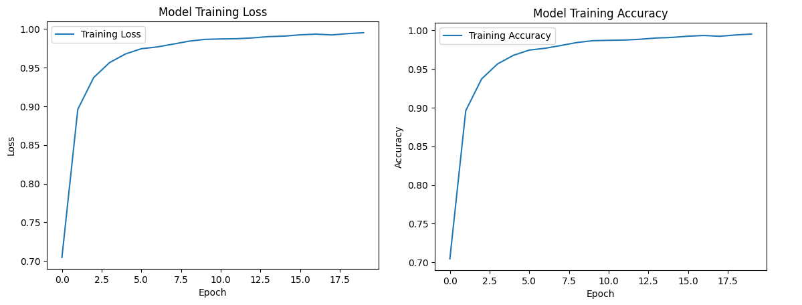
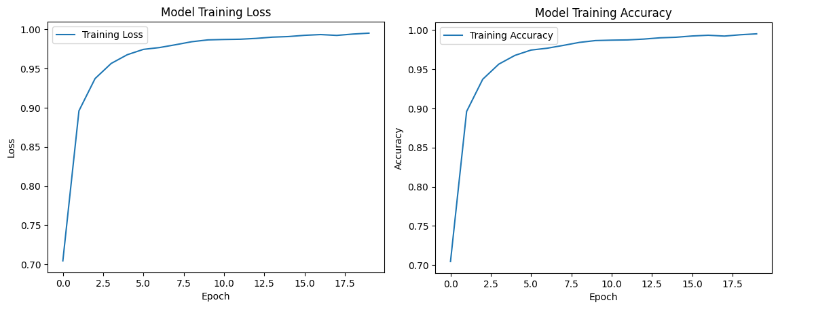
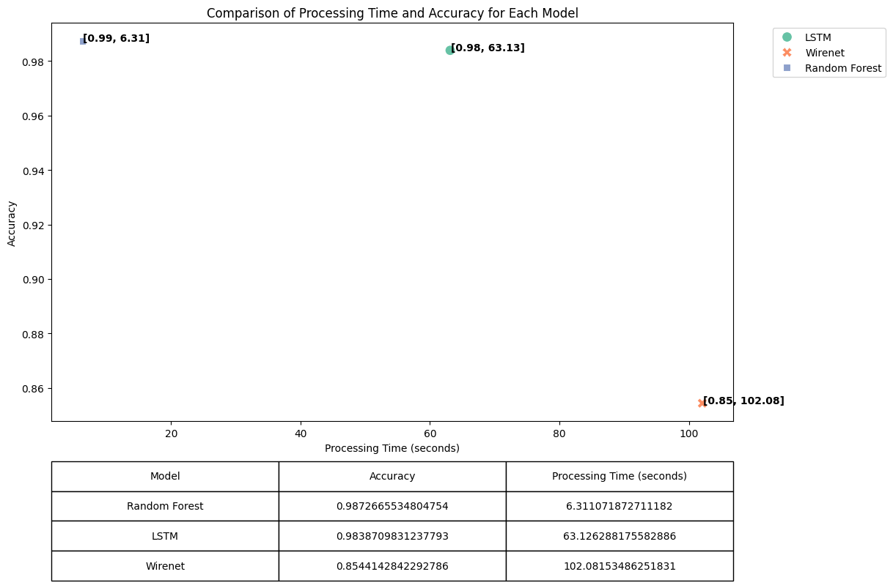

# DeepFake voice detection

this repo highlights my simple approach to train muliptle models for DeepFake voic recognition and test them comparing the results.

This [dataset](https://drive.google.com/file/d/11nYcEMRlhrOtXIH6eMW2VaMPAMIcztH2/view?usp=drive_link) used in this repo: 

## Overview

The notebook covers the following phases:

1. **Exploratory Data Analysis (EDA)**
2. **Modeling**
   - LSTM Model
   - WireNet Model
   - Random Forest Classifier (RFC)
3. **Model Evaluation and Comparison**

## Steps

### 1. Exploratory Data Analysis (EDA)

The EDA phase involves analyzing the dataset to understand its characteristics and distributions:

- The dataset is loaded from a CSV file. Below are some sample records from the dataset:

| chroma_stft | rms      | spectral_centroid | spectral_bandwidth | ... | mfcc17 | mfcc18 | LABEL |
|-------------|----------|--------------------|---------------------|-----|--------|--------|-------|
| 0.338055    | 0.027948 | 2842.948867       | 4322.916759        | ... | -7.251551 | -1.198342 | FAKE  |
| 0.443766    | 0.037838 | 2336.129597       | 3445.777044        | ... | -5.420016 | -2.109968 | FAKE  |
| 0.302528    | 0.056578 | 2692.988386       | 2861.133180        | ... | -6.072106 | -0.994653 | FAKE  |
| 0.319933    | 0.031504 | 2241.665382       | 3503.766175        | ... | 4.209121  | 0.121835  | FAKE  |
| 0.310207    | 0.049167 | 2150.047259       | 2423.259233        | ... | 1.533864  | -8.345302 | REAL  |
| 0.354885    | 0.023209 | 1901.105039       | 2159.132722        | ... | -2.620450 | -2.737077 | REAL  |
| 0.344487    | 0.041594 | 1739.885571       | 2431.456860        | ... | -7.800615 | -6.192214 | REAL  |
| 0.505184    | 0.044002 | 2547.780350       | 3057.374177        | ... | 2.071470  | 5.546173  | REAL  |

- **Label Encoding**: Labels are encoded for binary classification.
- **Distribution Plots**: Visualizations are created to show the distribution of features for different labels (Fake vs. Real).

- **Correlation Matrix**: A heatmap is plotted to visualize correlations between features.

### 2. Modeling

Three different models are implemented and evaluated:

- **LSTM Model**
  - A Sequential LSTM model is defined and trained.
  - Model Architecture

| Layer (type)      | Output Shape | Param #  |
|-------------------|--------------|----------|
| lstm (LSTM)       | (None, 17, 64) | 19,200   |
| lstm_1 (LSTM)     | (None, 64)     | 33,024   |
| dense (Dense)     | (None, 64)     | 4,160    |
| dropout (Dropout) | (None, 64)     | 0        |
| dense_1 (Dense)   | (None, 32)     | 2,080    |
| dropout_1 (Dropout)| (None, 32)    | 0        |
| dense_2 (Dense)   | (None, 1)      | 33       |
  - The model's evaluation highlights a test Loss of: 0.051 and a test accuracy: 0.98
  

- **WireNet Model**
  - A custom WireNet architecture is designed using Conv1D and LSTM layers.
  - The model is compiled and trained with a specified learning rate schedule.
  - The model's evaluation highlights a test Loss of: 3.54 and a test accuracy: 0.85

  

- **Random Forest Classifier (RFC)**
  - A Random Forest Classifier is trained and evaluated.
  - The model's evaluation highlights a test accuracy: 0.98.

### 3. Model Evaluation and Comparison

- The following plot perfectly represents the difference of each model's perofmorance based on accuracy and processing time:
  

## Running the Notebook

1. **Open the Notebook**: Use Jupyter Notebook or Google Colab to open the `deep_voice.ipynb` file.
2. **Execute Cells**: Run each cell sequentially to perform EDA, model training, and evaluation.
3. **Review Results**: Examine the visualizations and performance metrics to understand the outcomes.

## Files

- `deep_voice.ipynb`: Jupyter notebook containing the entire project workflow as this is a simple approach.

