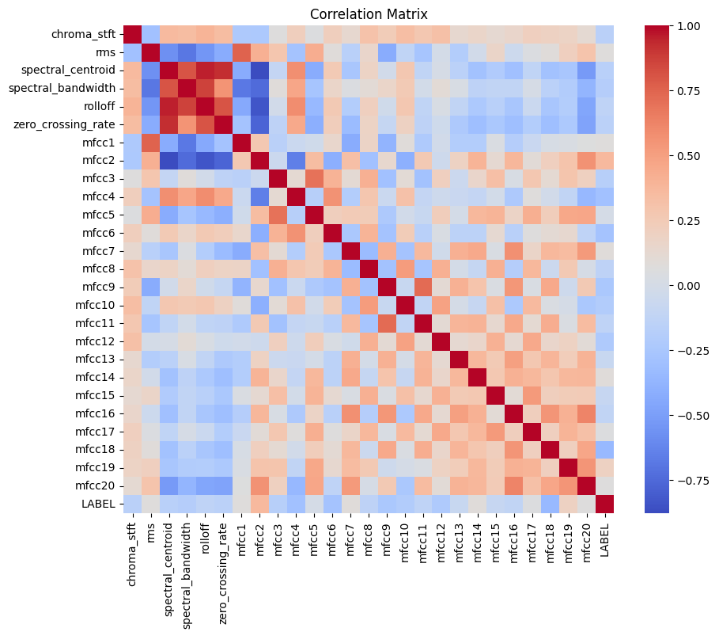

# DeepFake voice detection

this repo highlights my simple approach to train muliptle models for DeepFake voic recognition and test them comparing the results.

This [dataset](https://drive.google.com/file/d/11nYcEMRlhrOtXIH6eMW2VaMPAMIcztH2/view?usp=drive_link) used in this repo: 

## Overview

The notebook covers the following phases:

1. **Exploratory Data Analysis (EDA)**
2. **Modeling**
   - LSTM Model
   - WireNet Model
   - Random Forest Classifier (RFC)
3. **Model Evaluation and Comparison**

## Steps

### 1. Exploratory Data Analysis (EDA)

The EDA phase involves analyzing the dataset to understand its characteristics and distributions:

- **Loading Data**: The dataset is loaded from a CSV file.
- **Label Encoding**: Labels are encoded for binary classification.
- **Distribution Plots**: Visualizations are created to show the distribution of features for different labels (Fake vs. Real).

- **Correlation Matrix**: A heatmap is plotted to visualize correlations between features.

### 2. Modeling

Three different models are implemented and evaluated:

- **LSTM Model**
  - A Sequential LSTM model is defined and trained.
  - The model's performance is evaluated based on accuracy and loss metrics.
  - Model Architecture

| Layer (type)      | Output Shape | Param #  |
|-------------------|--------------|----------|
| lstm (LSTM)       | (None, 17, 64) | 19,200   |
| lstm_1 (LSTM)     | (None, 64)     | 33,024   |
| dense (Dense)     | (None, 64)     | 4,160    |
| dropout (Dropout) | (None, 64)     | 0        |
| dense_1 (Dense)   | (None, 32)     | 2,080    |
| dropout_1 (Dropout)| (None, 32)    | 0        |
| dense_2 (Dense)   | (None, 1)      | 33       |

  
- **WireNet Model**
  - A custom WireNet architecture is designed using Conv1D and LSTM layers.
  - The model is compiled and trained with a specified learning rate schedule.
  - Performance metrics are collected and analyzed.
  
- **Random Forest Classifier (RFC)**
  - A Random Forest Classifier is trained and evaluated.
  - Accuracy is computed to assess the model's performance.

### 3. Model Evaluation and Comparison

- **Evaluation**: Each model's performance is evaluated on test data.
- **Comparison**: A comparison of processing time and accuracy for each model is presented in a scatter plot.

## Running the Notebook

1. **Open the Notebook**: Use Jupyter Notebook or Google Colab to open the `deep_voice.ipynb` file.
2. **Execute Cells**: Run each cell sequentially to perform EDA, model training, and evaluation.
3. **Review Results**: Examine the visualizations and performance metrics to understand the outcomes.

## Files

- `deep_voice.ipynb`: Jupyter notebook containing the entire project workflow.

## License

This project is licensed under the MIT License. See the [LICENSE](LICENSE) file for details.
